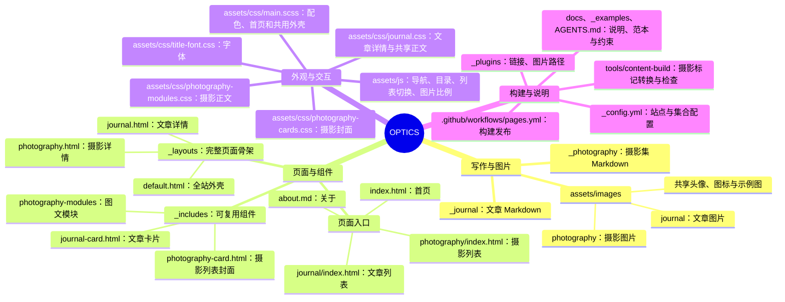

# 代码地图

两个英文名始终对应两类内容：`journal` 是文章，`photography` 是摄影集。名称前面的 `_` 表示供 Jekyll 读取的源文件目录，不代表一个网址。

## 日常最可能修改的地方

| 文件或目录 | 负责什么 |
| --- | --- |
| `_journal/*.md` | 文章标题、日期、地点、摘要、封面和 Markdown 正文 |
| `_photography/*.md` | 摄影集标题、日期、地点、封面、主题、中文图文模块；兼容旧 YAML blocks |
| `assets/images/journal/` | 每篇文章自己的原图文件夹 |
| `assets/images/photography/` | 每个摄影集自己的原图文件夹；原始素材不改写 |
| `assets/images/window-light.webp` | 全站共用的眼镜桌面示例图 |
| `assets/images/about-avatar.svg`、`favicon.svg` | 关于页头像、站点图标 |
| `index.html` | 首页三屏及其内容选择：文章与摄影各一主卡、两条次条 |
| `journal/index.html` | 文章列表的抬头、按日期倒序取内容、调用文章卡片 |
| `photography/index.html` | 摄影列表的抬头、按日期倒序取内容、调用摄影卡片 |
| `about.md`、`404.html` | 关于页、未找到页面 |

## 布局与组件

| 文件 | 负责什么 |
| --- | --- |
| `_layouts/default.html` | 所有页面的 HTML 外壳，字体、CSS、脚本、页眉、页脚、SEO |
| `_layouts/journal.html` | 单篇文章的抬头、日期地点、封面、正文、文末 |
| `_layouts/photography.html` | 单个摄影集的 opening、信息栏、模块循环和文末；已合并旧的两层模板 |
| `_includes/journal-card.html` | 文章列表卡片：标题、摘要、年月、按分类选深浅色 |
| `_includes/cover-image.html` | 首页与影像列表共用的响应式封面图片，缺少衍生图时回退原地址 |
| `_includes/photography-card.html` | 摄影列表卡片：居中 OPTICS、标题、日期地点、裁切封面、深浅主题 |
| `_includes/photography-modules/block.html` | 根据模块类型安排单图、双联、三联、大小图、图文、纯文字 |
| `_includes/photography-modules/image.html` | 单张照片、比例提示、替代文字、图注、加载属性 |
| `_includes/photography-modules/text.html` | 图文模块中的文字，复用 `.journal-content` 正文规则 |
| `_includes/image-url.html` | 模板共用的图片地址入口，调用统一解析函数 |
| `_includes/layout-switch.html` | 只供列表页使用的卡片／列表双按钮 |
| `_includes/reading-tools.html` | 文章侧栏“目录”文字开关与面板；小屏入口在 header 中 |
| `_includes/reading-neighbors.html` | 两类详情的篇末前后导航 |
| `_includes/header.html`、`footer.html` | 页眉导航和页脚 |
| `_includes/brand-mark.html` | 品牌标志 |

首页卡片有独立布局，写在 `index.html`，类名分别为 `.home-journal-card` 和 `.home-photography-card`。它们不复用列表卡片，保持已确认的首页设计。

## 样式和脚本

| 文件 | 找什么 |
| --- | --- |
| `assets/css/main.scss` | `:root` 全站色号；`.home-*` 首页；`.journal-card*` 文章卡片；页眉、页脚、关于页与响应式规则 |
| `assets/css/journal.css` | 文章抬头、封面、固定宽版正文、文末与响应式；摄影文字复用正文规则 |
| `assets/css/layout-switches.css` | 两类列表的双按钮和列表布局，只在列表页加载 |
| `assets/css/reading-tools.css` | 详情返回、目录、页脚边界与篇末导航 |
| `assets/css/title-font.css` | 已确认的 LXGW WenKai TC 700、OPTICS 字体和字距，以及各自作用范围 |
| `assets/css/photography-cards.css` | 摄影列表封面的三列网格、深浅主题、图片裁切 |
| `assets/css/photography-modules.css` | 摄影详情页的留白、各模块宽度、图文对齐和手机规则 |
| `assets/js/main.js` | 手机导航、首页卡片尺寸同步、关于页头像悬停切换 |
| `assets/js/layout-switches.js` | 两类列表的卡片／列表切换，不保存跨页面状态 |
| `assets/js/reading-tools.js` | 目录生成、锚点、开关与滚动边界，无版式切换 |
| `assets/js/photography-modules.js` | 读取照片自然比例，识别横竖方，调整组合图片的栏宽 |

首页「文」和用户上传的叠放相片轮廓是静态 SVG；没有描边动画或动画时长变量。文章正文固定宽版；摄影整篇的 `density: airy` 生效，未填写默认 Full。

## 构建过程

1. `tools/content-build/cli.mjs prepare` 复制源文件到 `_content_build`，由 `parser.mjs` 把摄影中文标记转换成 blocks。源文件不回写；`cover-images.mjs` 自动生成封面 WebP 缩略图及 `_data/cover_images.json`，仅写入构建副本。
2. Jekyll 读取 `_config.yml`、两个内容集合、模板与 `_plugins`。
3. `_plugins/journal.rb` 根据文章文件名生成稳定链接，处理订阅 ID、SEO 类型和重复链接检查。
4. `_plugins/image_paths.rb` 拼接图片地址；正文先由原来的 Kramdown 渲染，再只处理 HTML 图片元素。文章、摄影和订阅共用解析规则。
5. Jekyll 输出 `_site`。`feed.xml` 生成文章 Atom 订阅，地址仍是 `/feed.xml`。
6. `tools/content-build/verify_site.rb` 核对文章/摄影数量、站内链接、图片（包括 `srcset` 变体）、样式脚本和订阅。当前缺失的 12 张原图在 `known-missing-images.json` 中逐张记录；其他新错误会阻止发布。
7. `.github/workflows/pages.yml` 把通过检查的 `_site` 发布到 GitHub Pages。

`_content_build`、`_site`、`node_modules`、`vendor` 是生成内容或依赖，不是写作入口，不提交。

## 旧名称对应表

| 旧名称 | 现用名称 |
| --- | --- |
| `_posts`、`site.posts` | `_journal`、`site.journal` |
| `_layouts/post.html` | `_layouts/journal.html` |
| `post-card` | `journal-card` |
| `.article`、`.article-*` | `.journal`、`.journal-*` |
| `_layouts/photo-story.html` + `_includes/photo-modules/album.html` | 合并为 `_layouts/photography.html` |
| `_includes/photo-cover-card.html` | `_includes/cover-image.html` | 首页与影像列表共用的响应式封面图片，缺少衍生图时回退原地址 |
| `_includes/photography-card.html` |
| `photo-modules`、`.album-*` | `photography-modules`、`.photography-*` |
| `tools/album-markup`、`_album_build` | `tools/content-build`、`_content_build` |

代码中的 `<article>` 是标准 HTML 标签，表示一块独立内容；它不是第三种内容目录，因此保留。历史提交中的旧名称也不会改写，恢复旧版时应按本表对应到现用名称。
